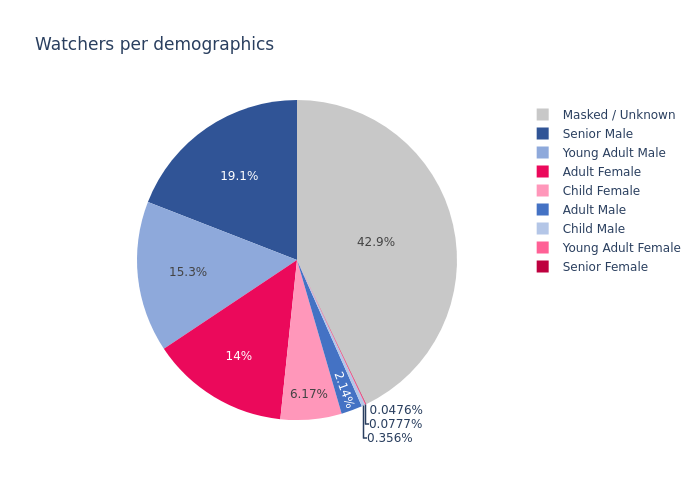

.. _chart:

Charts
======

The chart api endpoint provides you with a small set of predefined charts.

Default charts
##############

URL
---

``https://vidicenter.quividi.com/api/v1/chart/``

Mandatory arguments
-------------------

* ``chart_type``: the type of chart you want to generate. Allowed values:

    * ``0``: test chart.
    * ``1``: total impressions and watchers for the period.
    * ``2``: average attention time and presence time.
    * ``3``: breakdown of watchers per demographics.
    * ``4``: impressions and watchers per day.
    * ``5``: average attention time and presence time per day.
    * ``6``: top 10 locations for impressions & watchers.
    * ``7``: top 10 locations for average attention time and presence time.
    * ``8``: APC table, watchers per content.

* ``chart_period``: period of the chart you want to generate. Allowed values:

    * ``day``: previous full day.
    * ``week``: past week.
    * ``month``: past month.

* ``chart_format``: type of response expected. Allowed values:

    * ``image``: a binary image file in PNG format.
    * ``json``: raw numbers representing the chart in JSON format, useful to generate your own charts.

* ``network_id``: ID of the network for which the chart should be generated.

*OR*

* ``vendor_id``: ID of the vendor for which the chart should be generated.
* ``vendor_network_id``: ID of the vendor network for which the chart should be generated.

Note about APC chart
--------------------
APC charts will not have any data if the CMS API is not implemented on the edge. Please visit the `CMS API section <https://vidicenter.quividi.com/vrmanual/prepostbid.html>`_ in the VidiReports manual for more information

Response's form
---------------

This api endpoint returns a binary image file in PNG format.

curl examples
-------------

Here is an examples on how to make calls against the chart API.

 ::

    curl -u USERNAME:AUTH_TOKEN 'https://vidicenter.quividi.com/api/v1/chart/?chart_type=4&chart_period=week&chart_format=json&network_id=123'
    {
      "metric": {
        "0": "Watchers",
        "1": "Watchers",
        "2": "Watchers",
        "3": "Watchers",
        "4": "Watchers",
        "5": "Watchers",
        "6": "Watchers",
        "7": "Watchers",
        "8": "Impressions",
        "9": "Impressions",
        "10": "Impressions",
        "11": "Impressions",
        "12": "Impressions",
        "13": "Impressions",
        "14": "Impressions",
        "15": "Impressions"
      },
      "date": {
        "0": "2022-01-25",
        "1": "2022-01-26",
        "2": "2022-01-27",
        "3": "2022-01-28",
        "4": "2022-01-29",
        "5": "2022-01-30",
        "6": "2022-01-31",
        "7": "2022-02-01",
        "8": "2022-01-25",
        "9": "2022-01-26",
        "10": "2022-01-27",
        "11": "2022-01-28",
        "12": "2022-01-29",
        "13": "2022-01-30",
        "14": "2022-01-31",
        "15": "2022-02-01"
      },
      "count": {
        "0": 139820,
        "1": 145918,
        "2": 149832,
        "3": 214979,
        "4": 380036,
        "5": 239112,
        "6": 160306,
        "7": 168189,
        "8": 620973,
        "9": 647391,
        "10": 675640,
        "11": 1058382,
        "12": 1723385,
        "13": 1116993,
        "14": 691686,
        "15": 747844
      }
    }

In case of "image" chart_format, you can put the binary result in a file like this

::
curl -u USERNAME:AUTH_TOKEN 'https://vidicenter.quividi.com/api/v1/chart/?chart_type=4&chart_period=week&chart_format=image&network_id=123' > mychart.png

image examples
--------------

.. image:: images/chart_04.png
.. image:: images/chart_05.png
.. image:: images/chart_06.png
.. image:: images/chart_07.png
.. image:: images/chart_08.png

Advanced charts
###############

There is currently one chart api endpoint (specific permission required).

``https://vidicenter.quividi.com/api/v1/adv_chart/``

Mandatory arguments
-------------------

* ``chart_type``: the type of chart you want to generate. Allowed values:

    * ``0``: Dwell & Attention across content duration chart.

* ``start``: start date of the chart you want to generate, in the format ``YYYY-MM-DD``.

* ``end``: end date of the chart you want to generate, in the format ``YYYY-MM-DD``.

* ``chart_format``: type of response expected. Allowed values:

    * ``image``: a binary image file in PNG format.
    * ``json``: raw numbers representing the chart in JSON format, useful to generate your own charts.

And one of the following:

* ``locations``: IDs of the locations, comma separated for which the chart should be generated.
* ``sites``: ID of the sites, comma separated for which the chart should be generated.

*OR*

* ``auto_select_locations``: should be set to ``1`` if provided. Allow to automatically select locations that played the clips provided in the ``clip_ids`` argument.

Optional arguments
------------------

* ``clip_ids``: IDs of the clips, comma separated, for which the chart should be generated. Mandatory if ``auto_select_locations`` is provided.

curl examples
-------------

 ::

    curl -u USERNAME:AUTH_TOKEN "https://vidicenter.quividi.com/api/v1/adv_chart/?chart_type=0&chart_format=json&start=2025-04-01&end=2025-04-14&auto_select_locations=1&clip_ids=my_clip1,my_clip2"

    {"content_duration": {"0": "1st sec.", "1": "1st sec.", "2": "2nd sec.", "3": "2nd sec.", "4": "3rd sec.", "5": "3rd sec.", "6": "4th sec.", "7": "4th sec.", "8": "5th sec.", "9": "5th sec.", "10": "6th sec.", "11": "6th sec.", "1
    2": "7th sec.", "13": "7th sec.", "14": "8th sec.", "15": "8th sec.", "16": "9th sec.", "17": "9th sec.", "18": "10th sec.", "19": "10th sec."}, "metric": {"0": "dwell_time", "1": "attention_time", "2": "dwell_time", "3": "attenti
    on_time", "4": "dwell_time", "5": "attention_time", "6": "dwell_time", "7": "attention_time", "8": "dwell_time", "9": "attention_time", "10": "dwell_time", "11": "attention_time", "12": "dwell_time", "13": "attention_time", "14":
    "dwell_time", "15": "attention_time", "16": "dwell_time", "17": "attention_time", "18": "dwell_time", "19": "attention_time"}, "seconds": {"0": 182142, "1": 164637, "2": 205167, "3": 155492, "4": 219770, "5": 150344, "6": 227601,
    "7": 146721, "8": 232011, "9": 144730, "10": 234220, "11": 142858, "12": 216201, "13": 124685, "14": 57136, "15": 10769, "16": 2963, "17": 1468, "18": 2702, "19": 1390}

In case of "image" chart_format, you can put the binary result in a file like this

 ::

    curl -u USERNAME:AUTH_TOKEN "https://vidicenter.quividi.com/api/v1/adv_chart/?chart_type=0&chart_format=image&start=2025-04-01&end=2025-04-14&auto_select_locations=1&clip_ids=my_clip1,my_clip2" > output.png

image examples
--------------

