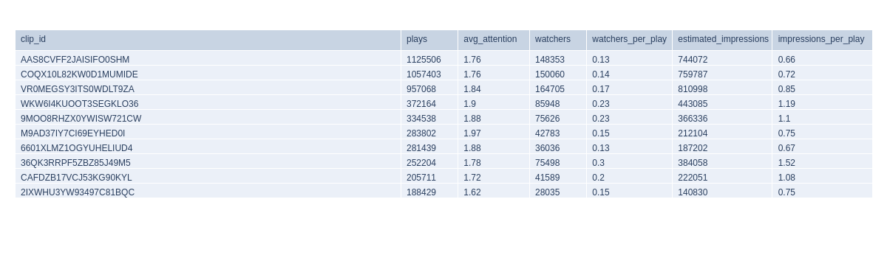

.. _chart:

Charts
======

The chart api endpoint provides you with a small set of predefined charts.

URL
---

``https://vidicenter.quividi.com/api/v1/chart/``

Mandatory arguments
-------------------

* ``chart_type``: the type of chart you want to generate. Allowed values:

    * ``0``: test chart.
    * ``1``: total impressions and watchers for the period.
    * ``2``: average attention time and presence time.
    * ``3``: breakdown of watchers per demographics.
    * ``4``: impressions and watchers per day.
    * ``5``: average attention time and presence time per day.
    * ``6``: top 10 locations for impressions & watchers.
    * ``7``: top 10 locations for average attention time and presence time.
    * ``8``: APC table, watchers per content.

* ``chart_period``: period of the chart you want to generate. Allowed values:

    * ``day``: previous full day.
    * ``week``: past week.
    * ``month``: past month.

* ``chart_format``: type of response expected. Allowed values:

    * ``image``: a binary image file in PNG format.
    * ``json``: raw numbers representing the chart in JSON format, useful to generate your own charts.

* ``network_id``: ID of the network for which the chart should be generated.

*OR*

* ``vendor_id``: ID of the vendor for which the chart should be generated.
* ``vendor_network_id``: ID of the vendor network for which the chart should be generated.

Note about APC chart
--------------------
APC charts will not have any data if the CMS API is not implemented on the edge. Please visit the `CMS API section <https://vidicenter.quividi.com/vrmanual/prepostbid.html>`_ in the VidiReports manual for more information

Response's form
---------------

This api endpoint returns a binary image file in PNG format.

curl examples
-------------

Here is an examples on how to make calls against the chart API.

 ::

    curl -u USERNAME:AUTH_TOKEN 'https://vidicenter.quividi.com/api/v1/chart/?chart_type=4&chart_period=week&chart_format=json&network_id=123'
    {
      "metric": {
        "0": "Watchers",
        "1": "Watchers",
        "2": "Watchers",
        "3": "Watchers",
        "4": "Watchers",
        "5": "Watchers",
        "6": "Watchers",
        "7": "Watchers",
        "8": "Impressions",
        "9": "Impressions",
        "10": "Impressions",
        "11": "Impressions",
        "12": "Impressions",
        "13": "Impressions",
        "14": "Impressions",
        "15": "Impressions"
      },
      "date": {
        "0": "2022-01-25",
        "1": "2022-01-26",
        "2": "2022-01-27",
        "3": "2022-01-28",
        "4": "2022-01-29",
        "5": "2022-01-30",
        "6": "2022-01-31",
        "7": "2022-02-01",
        "8": "2022-01-25",
        "9": "2022-01-26",
        "10": "2022-01-27",
        "11": "2022-01-28",
        "12": "2022-01-29",
        "13": "2022-01-30",
        "14": "2022-01-31",
        "15": "2022-02-01"
      },
      "count": {
        "0": 139820,
        "1": 145918,
        "2": 149832,
        "3": 214979,
        "4": 380036,
        "5": 239112,
        "6": 160306,
        "7": 168189,
        "8": 620973,
        "9": 647391,
        "10": 675640,
        "11": 1058382,
        "12": 1723385,
        "13": 1116993,
        "14": 691686,
        "15": 747844
      }
    }

image examples
--------------

.. image:: images/chart_01.png
.. image:: images/chart_02.png
.. image:: images/chart_03.png

.. image:: images/chart_05.png

